<div align="center">


# 🎓 Academic Enrollment System

**Dual List Selection Component with Hibernate Persistence**

A robust desktop solution built in **Java Swing** under the **MVC architecture**. The project focuses on a reusable visual component for item selection and data persistence using **Hibernate ORM**.


### 🌐 Choose Language / Selecione o idioma / Elija su idioma

[](./README.md)
[](./README_PT.md)
[](./README_ES.md)

</div>

---

## 📘 About the Project

> The **Academic Enrollment System** is a desktop application built to demonstrate advanced skills in **Object-Oriented Programming** and the **MVC architecture**. Its core feature is a reusable **"Dual List Selector"** component used to enroll students into subjects, backed by **Hibernate persistence** and an embedded **H2 database**.

---

## 📑 Table of Contents

| # | Section |
|:-:|:---|
| 1 | [📋 Requirements](#-1-requirements) |
| 2 | [🧩 Use Cases](#-2-use-cases) |
| 3 | [🔗 Requirements Traceability Matrix](#-3-requirements-traceability-matrix) |
| 4 | [📄 Software Requirements Specification (SRS)](#-4-software-requirements-specification-srs) |
| 5 | [🧬 UML & Structural Diagrams](#-5-uml--structural-diagrams) |
| 6 | [🗄️ Data Model & Data Dictionary](#️-6-data-model--data-dictionary) |
| 7 | [🔄 Data Flow Diagram (DFD) & Data Lineage](#-7-data-flow-diagram-dfd--data-lineage) |
| 8 | [🏗️ Architecture Diagram & Flowchart](#️-8-architecture-diagram--flowchart) |
| 9 | [🧑 Persona & User Journey Map](#-9-persona--user-journey-map) |
| 10 | [🖼️ Wireframes & Mockups](#️-10-wireframes--mockups) |
| 11 | [🚀 Installation & Execution](#-11-installation--execution) |
| 12 | [👤 Author](#-12-author) |

---

## 📋 1. Requirements

<details>
<summary><b>✅ Functional Requirements (FR)</b></summary>

| ID | Description |
|:---|:---|
| **FR01** | The system shall allow an administrator to log in with username and password. |
| **FR02** | The system shall allow CRUD operations for **Students**. |
| **FR03** | The system shall allow CRUD operations for **Subjects**. |
| **FR04** | The system shall provide a **Dual List Selector** to move subjects between "Available" and "Enrolled" lists. |
| **FR05** | The system shall persist Students, Subjects and Enrollments via **Hibernate ORM**. |
| **FR06** | The system shall list and filter a student's current enrollments. |
| **FR07** | The system shall allow cancelling an existing enrollment. |

</details>

<details>
<summary><b>⚙️ Non-Functional Requirements (NFR)</b></summary>

| ID | Description |
|:---|:---|
| **NFR01** | The graphical interface shall be built with **Java Swing**, with a layout that adapts to window resizing. |
| **NFR02** | The system shall run on **Java 23** or higher. |
| **NFR03** | CRUD operations shall respond in under **1 second** for up to 10,000 records. |
| **NFR04** | The system shall be portable: a single executable JAR with an embedded **H2** database. |
| **NFR05** | The source code shall follow the **MVC** pattern to ensure maintainability. |

</details>

<details>
<summary><b>📐 Business Rules (BR)</b></summary>

| ID | Description |
|:---|:---|
| **BR01** | A student **cannot** be enrolled twice in the same subject. |
| **BR02** | A student may be enrolled in a **maximum of 6 subjects** per semester. |
| **BR03** | A subject can only be deleted if it has **no active enrollments**. |
| **BR04** | Only authenticated administrators may access management screens. |

</details>

<details>
<summary><b>🌍 Domain Requirements</b></summary>

- The system must use academic terminology consistent with the institution's curriculum (subjects, workload in hours, credits).
- Each subject has a fixed number of **credits** and **workload (hours)**, defined by the curriculum.
- Enrollment periods follow the institution's academic calendar (semester-based).

</details>

<details>
<summary><b>💾 Data Requirements</b></summary>

- Each student must have a **unique registration number**.
- E-mail addresses must be validated for correct format.
- Referential integrity must be enforced between `Enrollment`, `Student` and `Subject`.
- All persisted entities must have an auto-generated primary key (`id`).

</details>

<details>
<summary><b>🖱️ Interface Requirements</b></summary>

- The enrollment screen must implement the **Dual List Selector** pattern (Available ⇄ Enrolled).
- Default access on first run: **user:** `admin` / **password:** `1234`.
- Items can be moved between lists via buttons (`➡️`/`⬅️`) or double-click.
- Forms must display validation errors inline, near the related field.

</details>

---

## 🧩 2. Use Cases

<details open>
<summary><b>📜 Use Case Summary Table</b></summary>

| UC ID | Name | Actor | Description |
|:---|:---|:---|:---|
| **UC01** | Login | Administrator | Authenticate into the system. |
| **UC02** | Manage Students | Administrator | Create, read, update and delete students. |
| **UC03** | Manage Subjects | Administrator | Create, read, update and delete subjects. |
| **UC04** | Enroll Student in Subjects | Administrator | Use the Dual List Selector to enroll/unenroll. |
| **UC05** | View Enrollments | Administrator | List and filter a student's enrollments. |

</details>

<details>
<summary><b>🗺️ Use Case Diagram</b></summary>

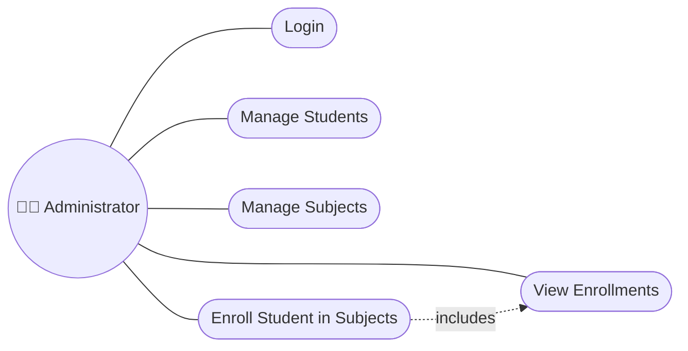

</details>

<details>
<summary><b>📝 Detailed Use Case — UC04: Enroll Student in Subjects</b></summary>

| Field | Description |
|:---|:---|
| **Actor** | Administrator |
| **Preconditions** | Administrator is logged in; the student exists. |
| **Main Flow** | 1. Select a student.<br>2. The "Available Subjects" list is loaded.<br>3. Move desired subjects to the "Enrolled" list.<br>4. Click "Confirm".<br>5. System validates business rules (BR01, BR02).<br>6. Enrollment is persisted via Hibernate. |
| **Alternative Flow** | 5a. If the maximum of 6 subjects is exceeded, show a validation message. |
| **Postconditions** | New `Enrollment` records are saved to the database. |

</details>

---

## 🔗 3. Requirements Traceability Matrix

<details open>
<summary><b>📊 Traceability Table</b></summary>

| Requirement | Use Case | Component / Class | Test Case |
|:---|:---|:---|:---|
| FR01 | UC01 | `LoginController`, `User` | TC01 |
| FR02 | UC02 | `StudentController`, `StudentDAO` | TC02 |
| FR03 | UC03 | `SubjectController`, `SubjectDAO` | TC03 |
| FR04 | UC04 | `DualListSelector`, `EnrollmentService` | TC04 |
| FR05 | UC02, UC03, UC04 | `HibernateUtil`, all DAOs | TC05 |
| FR06 | UC05 | `EnrollmentDAO`, `EnrollmentReportView` | TC06 |
| FR07 | UC04 | `EnrollmentService.cancel()` | TC07 |
| BR01, BR02 | UC04 | `EnrollmentService.validate()` | TC08 |

</details>

---

## 📄 4. Software Requirements Specification (SRS)

<details open>
<summary><b>📃 SRS Summary (IEEE 830 structure)</b></summary>

| Section | Content |
|:---|:---|
| **1. Introduction** | Purpose: define an academic enrollment desktop system. Scope: student, subject and enrollment management with a reusable dual list selector. |
| **2. Overall Description** | Standalone Java Swing desktop application, MVC architecture, Hibernate ORM, embedded H2 database. |
| **3. Specific Requirements** | See [Section 1 — Requirements](#-1-requirements) (FR, NFR, BR, Domain, Data, Interface). |
| **4. External Interfaces** | Graphical interface (Swing); persistence interface (Hibernate/JDBC to H2). |
| **5. Constraints** | Java 23+, Maven 3.8+, single-user desktop usage. |
| **6. Acceptance Criteria** | All use cases (UC01–UC05) executable without errors; data persisted between sessions. |

</details>

---

## 🧬 5. UML & Structural Diagrams

<details>
<summary><b>1️⃣ Use Case Diagram</b></summary>

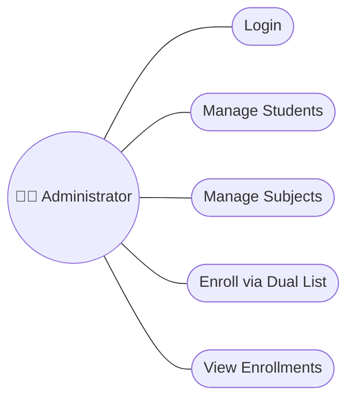

</details>

<details>
<summary><b>2️⃣ Class Diagram</b></summary>

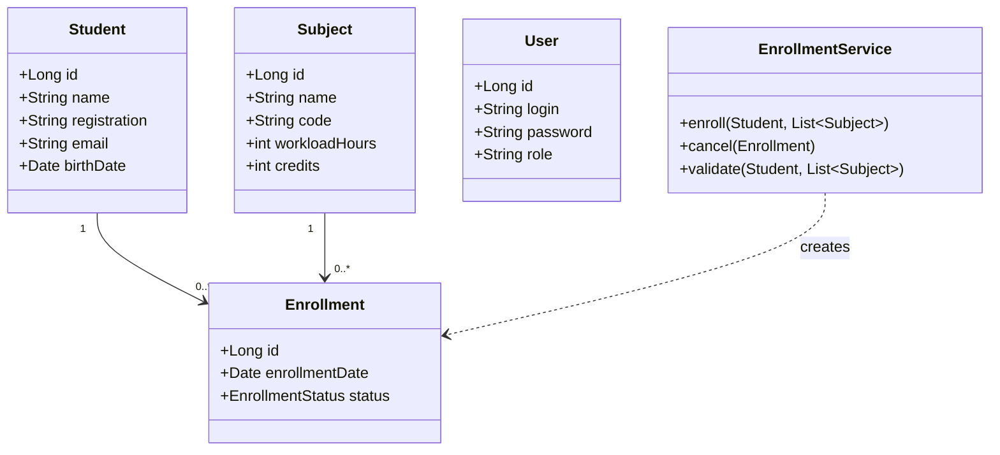

</details>

<details>
<summary><b>3️⃣ Object Diagram</b></summary>

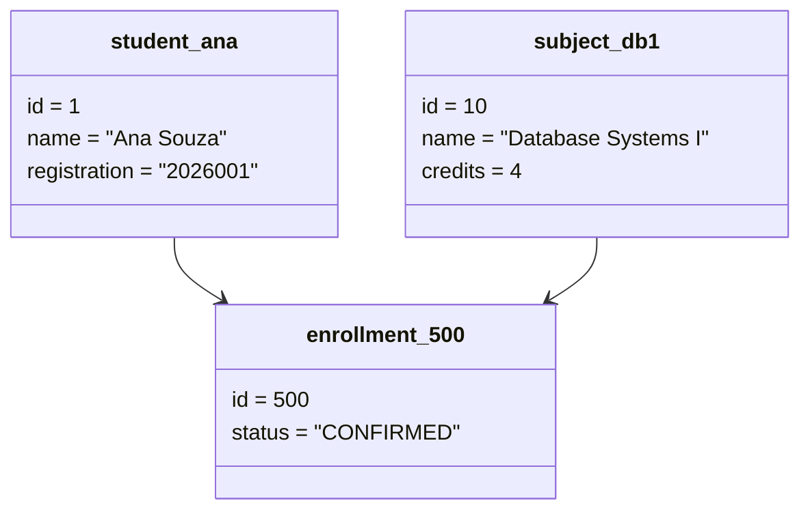

</details>

<details>
<summary><b>4️⃣ Sequence Diagram — Enroll Student</b></summary>

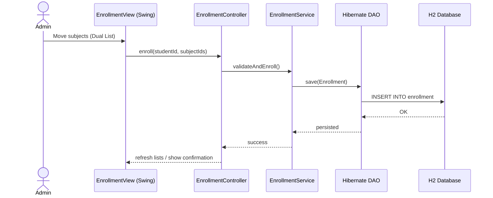

</details>

<details>
<summary><b>5️⃣ Communication (Collaboration) Diagram</b></summary>

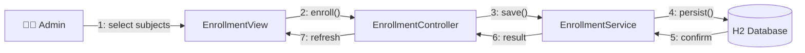

</details>

<details>
<summary><b>6️⃣ Activity Diagram</b></summary>

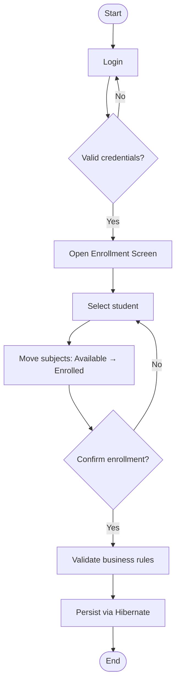

</details>

<details>
<summary><b>7️⃣ State Machine Diagram — Enrollment</b></summary>

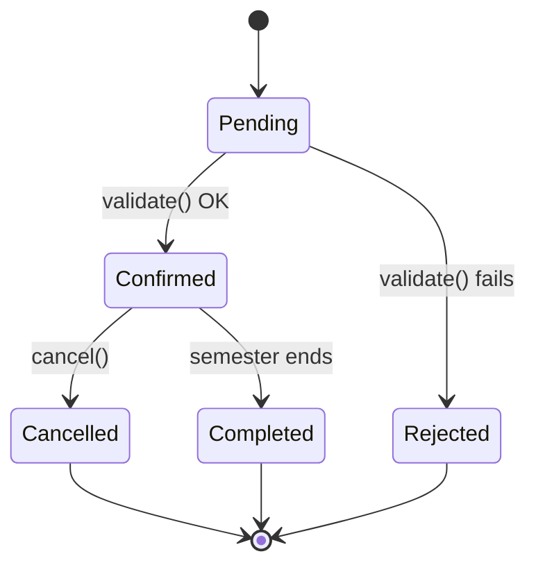

</details>

<details>
<summary><b>8️⃣ Component Diagram</b></summary>

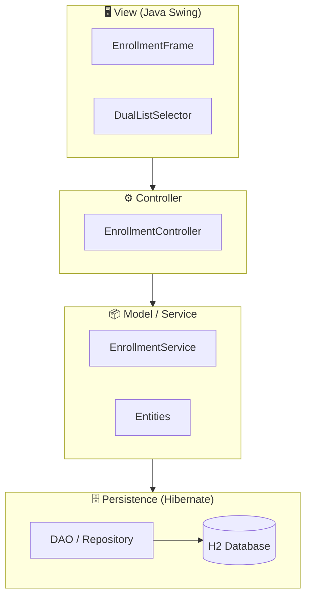

</details>

<details>
<summary><b>9️⃣ Deployment Diagram</b></summary>

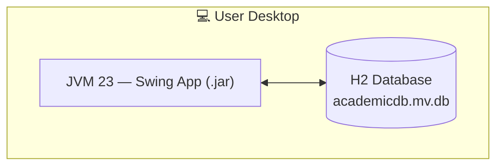

</details>

<details>
<summary><b>🔟 Package Diagram</b></summary>

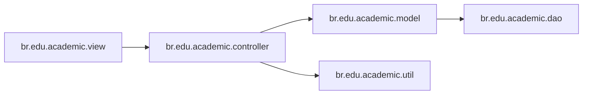

</details>

<details>
<summary><b>1️⃣1️⃣ Composite Structure Diagram — DualListSelector</b></summary>

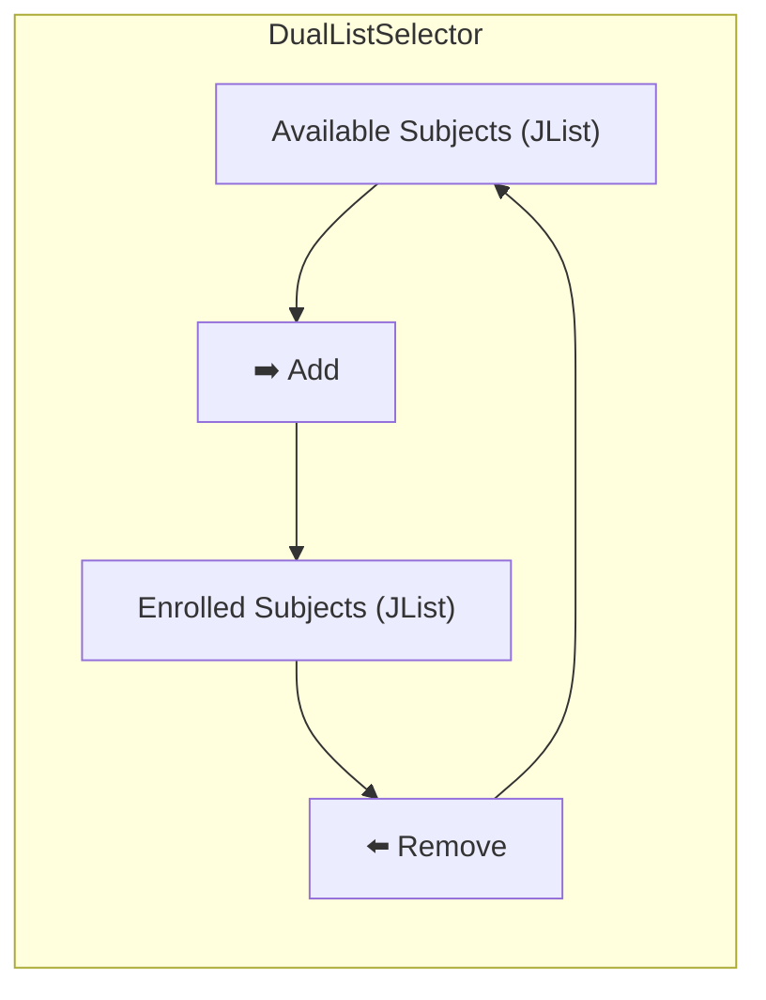

</details>

<details>
<summary><b>1️⃣2️⃣ Interaction Overview Diagram</b></summary>

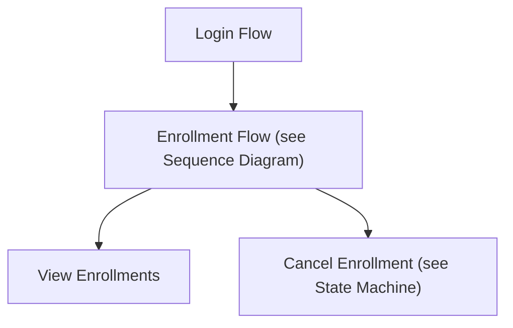

</details>

<details>
<summary><b>1️⃣3️⃣ Timing Diagram</b></summary>

| Time | Administrator | EnrollmentController | H2 Database |
|:---|:---|:---|:---|
| t0 | Idle | Idle | Idle |
| t1 | Selecting subjects | Idle | Idle |
| t2 | Clicks "Confirm" | Processing request | Idle |
| t3 | Waiting | Calling `save()` | Writing |
| t4 | Sees confirmation | Idle | Committed |

</details>

---

## 🗄️ 6. Data Model & Data Dictionary

<details open>
<summary><b>🔗 Entity-Relationship Diagram (ERD)</b></summary>

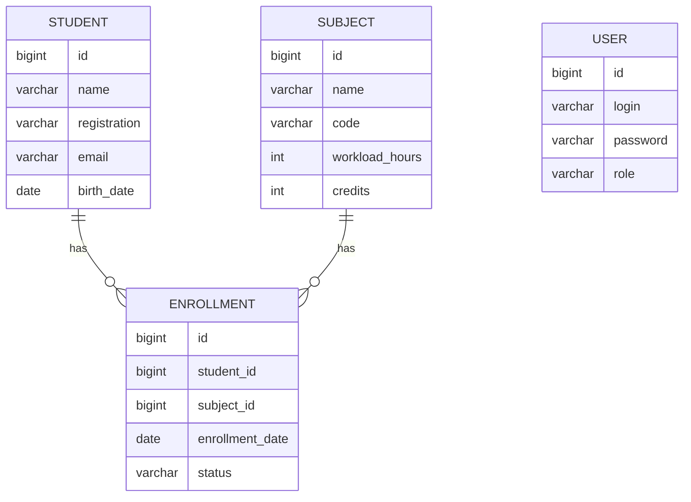

</details>

<details>
<summary><b>🧠 Conceptual Data Model</b></summary>

A **Student** can have many **Enrollments**; a **Subject** can have many **Enrollments**. An **Enrollment** links exactly one Student to one Subject (associative entity). A **User** represents an administrator account, independent of the academic entities.

</details>

<details>
<summary><b>🧩 Logical Data Model</b></summary>

| Entity | Attribute | Type | Key |
|:---|:---|:---|:---|
| Student | id, name, registration, email, birthDate | Long, String, String, String, Date | PK: id |
| Subject | id, name, code, workloadHours, credits | Long, String, String, int, int | PK: id |
| Enrollment | id, studentId, subjectId, enrollmentDate, status | Long, Long(FK), Long(FK), Date, Enum | PK: id |
| User | id, login, password, role | Long, String, String, String | PK: id |

</details>

<details>
<summary><b>⚙️ Physical Data Model (H2 DDL)</b></summary>

```sql
CREATE TABLE student (
    id BIGINT AUTO_INCREMENT PRIMARY KEY,
    name VARCHAR(120) NOT NULL,
    registration VARCHAR(20) UNIQUE NOT NULL,
    email VARCHAR(120) NOT NULL,
    birth_date DATE
);

CREATE TABLE subject (
    id BIGINT AUTO_INCREMENT PRIMARY KEY,
    name VARCHAR(120) NOT NULL,
    code VARCHAR(10) UNIQUE NOT NULL,
    workload_hours INT NOT NULL,
    credits INT NOT NULL
);

CREATE TABLE enrollment (
    id BIGINT AUTO_INCREMENT PRIMARY KEY,
    student_id BIGINT NOT NULL REFERENCES student(id),
    subject_id BIGINT NOT NULL REFERENCES subject(id),
    enrollment_date DATE NOT NULL,
    status VARCHAR(15) NOT NULL,
    UNIQUE (student_id, subject_id)
);
```

</details>

<details>
<summary><b>📖 Data Dictionary</b></summary>

| Entity | Field | Type | Constraints | Description |
|:---|:---|:---|:---|:---|
| Student | registration | VARCHAR(20) | UNIQUE, NOT NULL | Institutional registration number |
| Student | email | VARCHAR(120) | NOT NULL, format-validated | Student's e-mail |
| Subject | code | VARCHAR(10) | UNIQUE, NOT NULL | Subject code (e.g., DB101) |
| Subject | credits | INT | NOT NULL | Number of academic credits |
| Enrollment | status | VARCHAR(15) | ENUM: PENDING/CONFIRMED/CANCELLED/COMPLETED | Current enrollment state |
| Enrollment | (student_id, subject_id) | FK pair | UNIQUE | Enforces business rule BR01 |

</details>

---

## 🔄 7. Data Flow Diagram (DFD) & Data Lineage

<details open>
<summary><b>🌐 DFD — Level 0 (Context)</b></summary>

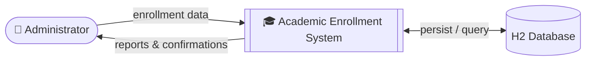

</details>

<details>
<summary><b>🔬 DFD — Level 1</b></summary>

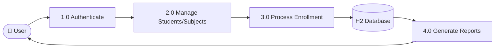

</details>

<details>
<summary><b>🧵 Data Lineage Diagram</b></summary>

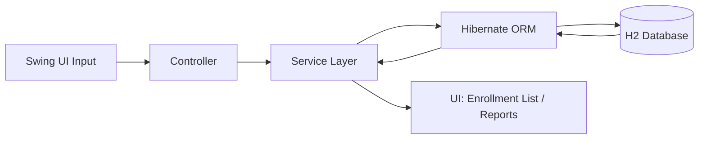

</details>

---

## 🏗️ 8. Architecture Diagram & Flowchart

<details open>
<summary><b>🏛️ Architecture Overview (MVC Layers)</b></summary>

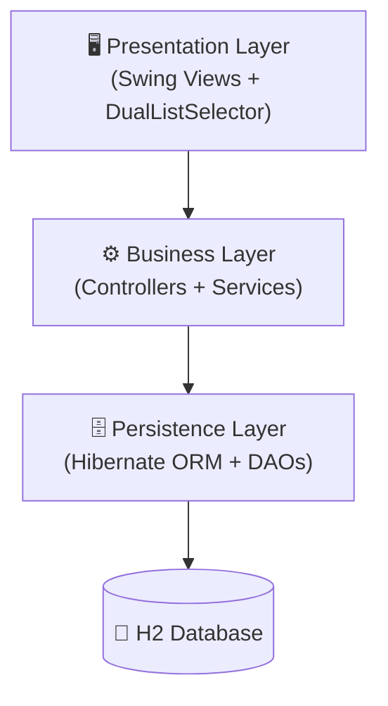

</details>

<details>
<summary><b>🔀 General Application Flowchart</b></summary>

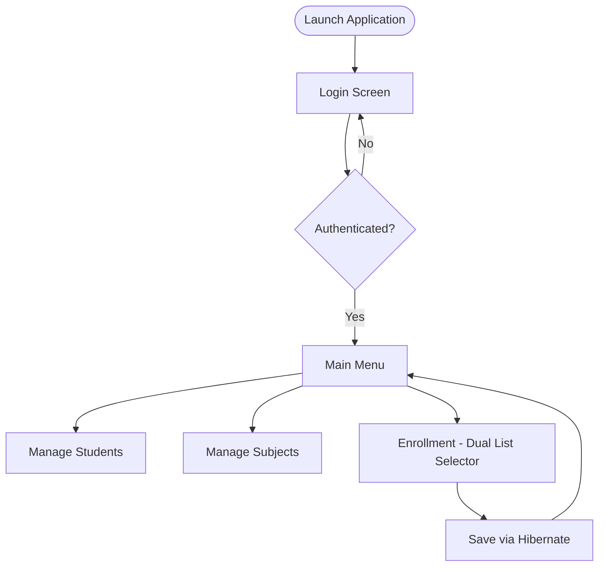

</details>

---

## 🧑 9. Persona & User Journey Map

<details open>
<summary><b>🙋 Persona — Academic Coordinator</b></summary>

| Field | Description |
|:---|:---|
| **Name** | Ana Souza |
| **Role** | Academic Coordinator |
| **Age** | 38 |
| **Goals** | Quickly enroll students into subjects each semester without errors. |
| **Frustrations** | Manual spreadsheets that allow duplicate enrollments. |
| **Tech Skills** | Intermediate — comfortable with desktop software. |

</details>

<details>
<summary><b>🗺️ User Journey Map</b></summary>

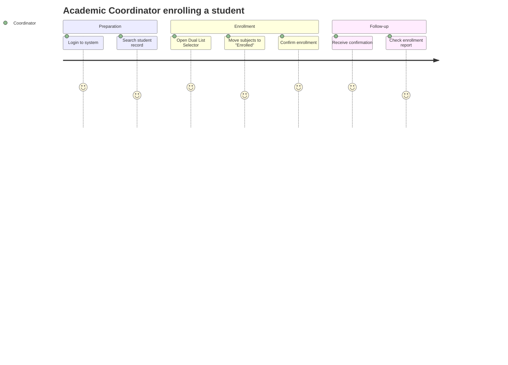

</details>

---

## 🖼️ 10. Wireframes & Mockups

<details open>
<summary><b>📐 Wireframe — Enrollment Screen</b></summary>

```
┌──────────────────────────────────────────────────────────┐
│  🎓 Academic Enrollment System                     [_][X] │
├──────────────────────────────────────────────────────────┤
│ Student: [ Ana Souza (2026001)            ▼ ]             │
├────────────────────────────┬───────────┬─────────────────┤
│  Available Subjects         │           │  Enrolled       │
│ ┌──────────────────────────┐│   [ ➡️ ]  │┌───────────────┐│
│ │ Algorithms I               ││   [ ⬅️ ]  ││ Databases I   ││
│ │ Operating Systems          ││           ││ Calculus II   ││
│ │ Networks                   ││           ││               ││
│ └──────────────────────────┘│           │└───────────────┘│
├────────────────────────────┴───────────┴─────────────────┤
│                                  [ Cancel ]   [ Confirm ✅ ]│
└──────────────────────────────────────────────────────────┘
```

</details>

<details>
<summary><b>🎨 Mockup — High-Fidelity Concept</b></summary>

```
╔════════════════════════════════════════════════════════════╗
║ 🎓  ACADEMIC ENROLLMENT SYSTEM                 🟢 admin    ║
╠════════════════════════════════════════════════════════════╣
║  👤 Student: Ana Souza — Reg. 2026001                       ║
║                                                              ║
║  📚 AVAILABLE             📗 ENROLLED                       ║
║  ┌────────────────┐       ┌────────────────┐               ║
║  │ Algorithms I    │  ➡️  │ Databases I     │               ║
║  │ Operating Sys.  │  ⬅️  │ Calculus II     │               ║
║  │ Networks        │       │                 │               ║
║  └────────────────┘       └────────────────┘               ║
║                                                              ║
║              [ ❌ Cancel ]     [ ✅ Confirm Enrollment ]    ║
╚════════════════════════════════════════════════════════════╝
```

</details>

---

## 🚀 11. Installation & Execution

<details open>
<summary><b>📋 Prerequisites</b></summary>

- ☕ Java JDK 23
- 📦 Maven 3.8+
- 🔧 Git (optional)
- 💻 Recommended IDE: IntelliJ IDEA

</details>

<details open>
<summary><b>🛠️ Steps</b></summary>

1. **Clone the repository:**

```bash
git clone https://github.com/VictorHJesusSantiago/buslist4hibernate.git
```

2. Open the project in your IDE and let Maven download dependencies from `pom.xml`.
3. Set the Project SDK to Java 23.
4. Run `src/main/java/br/edu/academic/MainApp.java`.

</details>

<details>
<summary><b>🔑 Default Access</b></summary>

On first run, the system seeds:

| Field | Value |
|:---|:---|
| **User** | `admin` |
| **Password** | `1234` |

</details>

---

## 👤 12. Author

<div align="center">

| | |
|:---:|:---|
| 🧑‍💻 | **Victor Henrique de Jesus Santiago** — Full Stack Developer |
| 📧 | victorhenriquedejesussantiago@gmail.com |
| 💼 | [LinkedIn](https://www.linkedin.com/in/victor-henrique-de-jesus-santiago/) |
| 🐙 | [GitHub/VictorHJesusSantiago](https://github.com/VictorHJesusSantiago) |

</div>
