<div align="center">


# 🎓 Academic Enrollment System

**Componente de Selección de Lista Doble con Persistencia mediante Hibernate**

Una solución de escritorio robusta construida en **Java Swing** bajo la **arquitectura MVC**. El proyecto se centra en un componente visual reutilizable para la selección de elementos y la persistencia de datos usando **Hibernate ORM**.


### 🌐 Choose Language / Selecione o idioma / Elija su idioma

[](./README.md)
[](./README_PT.md)
[](./README_ES.md)

</div>

---

## 📘 Sobre el Proyecto

> El **Academic Enrollment System** es una aplicación de escritorio construida para demostrar habilidades avanzadas en **Programación Orientada a Objetos** y en la **arquitectura MVC**. Su característica principal es un componente reutilizable de **"Selector de Lista Doble"** utilizado para inscribir estudiantes en asignaturas, respaldado por **persistencia con Hibernate** y una base de datos embebida **H2**.

---

## 📑 Tabla de Contenidos

| # | Sección |
|:-:|:---|
| 1 | [📋 Requisitos](#-1-requisitos) |
| 2 | [🧩 Casos de Uso](#-2-casos-de-uso) |
| 3 | [🔗 Matriz de Trazabilidad de Requisitos](#-3-matriz-de-trazabilidad-de-requisitos) |
| 4 | [📄 Especificación de Requisitos de Software (SRS)](#-4-especificación-de-requisitos-de-software-srs) |
| 5 | [🧬 Diagramas UML y Estructurales](#-5-diagramas-uml-y-estructurales) |
| 6 | [🗄️ Modelo de Datos y Diccionario de Datos](#️-6-modelo-de-datos-y-diccionario-de-datos) |
| 7 | [🔄 Diagrama de Flujo de Datos (DFD) y Linaje de Datos](#-7-diagrama-de-flujo-de-datos-dfd-y-linaje-de-datos) |
| 8 | [🏗️ Diagrama de Arquitectura y Diagrama de Flujo](#️-8-diagrama-de-arquitectura-y-diagrama-de-flujo) |
| 9 | [🧑 Persona y Mapa de Viaje del Usuario](#-9-persona-y-mapa-de-viaje-del-usuario) |
| 10 | [🖼️ Wireframes y Mockups](#️-10-wireframes-y-mockups) |
| 11 | [🚀 Instalación y Ejecución](#-11-instalación-y-ejecución) |
| 12 | [👤 Autor](#-12-autor) |

---

## 📋 1. Requisitos

<details>
<summary><b>✅ Requisitos Funcionales (RF)</b></summary>

| ID | Descripción |
|:---|:---|
| **RF01** | El sistema debe permitir que un administrador inicie sesión con usuario y contraseña. |
| **RF02** | El sistema debe permitir operaciones CRUD para **Estudiantes**. |
| **RF03** | El sistema debe permitir operaciones CRUD para **Asignaturas**. |
| **RF04** | El sistema debe proporcionar un **Selector de Lista Doble** para mover asignaturas entre las listas "Disponibles" e "Inscritas". |
| **RF05** | El sistema debe persistir Estudiantes, Asignaturas e Inscripciones mediante **Hibernate ORM**. |
| **RF06** | El sistema debe listar y filtrar las inscripciones actuales de un estudiante. |
| **RF07** | El sistema debe permitir cancelar una inscripción existente. |

</details>

<details>
<summary><b>⚙️ Requisitos No Funcionales (RNF)</b></summary>

| ID | Descripción |
|:---|:---|
| **RNF01** | La interfaz gráfica debe construirse con **Java Swing**, con un diseño que se adapte al redimensionamiento de la ventana. |
| **RNF02** | El sistema debe ejecutarse en **Java 23** o superior. |
| **RNF03** | Las operaciones CRUD deben responder en menos de **1 segundo** para hasta 10.000 registros. |
| **RNF04** | El sistema debe ser portátil: un único JAR ejecutable con base de datos **H2** embebida. |
| **RNF05** | El código fuente debe seguir el patrón **MVC** para garantizar la mantenibilidad. |

</details>

<details>
<summary><b>📐 Reglas de Negocio (RN)</b></summary>

| ID | Descripción |
|:---|:---|
| **RN01** | Un estudiante **no puede** inscribirse dos veces en la misma asignatura. |
| **RN02** | Un estudiante puede inscribirse en un **máximo de 6 asignaturas** por semestre. |
| **RN03** | Una asignatura solo puede eliminarse si **no tiene inscripciones activas**. |
| **RN04** | Solo los administradores autenticados pueden acceder a las pantallas de gestión. |

</details>

<details>
<summary><b>🌍 Requisitos de Dominio</b></summary>

- El sistema debe usar terminología académica consistente con el plan de estudios de la institución (asignaturas, carga horaria, créditos).
- Cada asignatura tiene un número fijo de **créditos** y **carga horaria (en horas)**, definido por el plan de estudios.
- Los períodos de inscripción siguen el calendario académico de la institución (por semestre).

</details>

<details>
<summary><b>💾 Requisitos de Datos</b></summary>

- Cada estudiante debe tener un **número de matrícula único**.
- Las direcciones de correo electrónico deben validarse en cuanto a su formato correcto.
- Debe garantizarse la integridad referencial entre `Inscripción`, `Estudiante` y `Asignatura`.
- Todas las entidades persistidas deben tener una clave primaria autogenerada (`id`).

</details>

<details>
<summary><b>🖱️ Requisitos de Interfaz</b></summary>

- La pantalla de inscripción debe implementar el patrón **Selector de Lista Doble** (Disponibles ⇄ Inscritas).
- Acceso predeterminado en la primera ejecución: **usuario:** `admin` / **contraseña:** `1234`.
- Los elementos se pueden mover entre listas mediante botones (`➡️`/`⬅️`) o doble clic.
- Los formularios deben mostrar errores de validación en línea, junto al campo correspondiente.

</details>

---

## 🧩 2. Casos de Uso

<details open>
<summary><b>📜 Tabla Resumen de Casos de Uso</b></summary>

| ID CU | Nombre | Actor | Descripción |
|:---|:---|:---|:---|
| **UC01** | Iniciar Sesión | Administrador | Autenticarse en el sistema. |
| **UC02** | Gestionar Estudiantes | Administrador | Crear, leer, actualizar y eliminar estudiantes. |
| **UC03** | Gestionar Asignaturas | Administrador | Crear, leer, actualizar y eliminar asignaturas. |
| **UC04** | Inscribir Estudiante en Asignaturas | Administrador | Usar el Selector de Lista Doble para inscribir/dar de baja. |
| **UC05** | Ver Inscripciones | Administrador | Listar y filtrar las inscripciones de un estudiante. |

</details>

<details>
<summary><b>🗺️ Diagrama de Casos de Uso</b></summary>

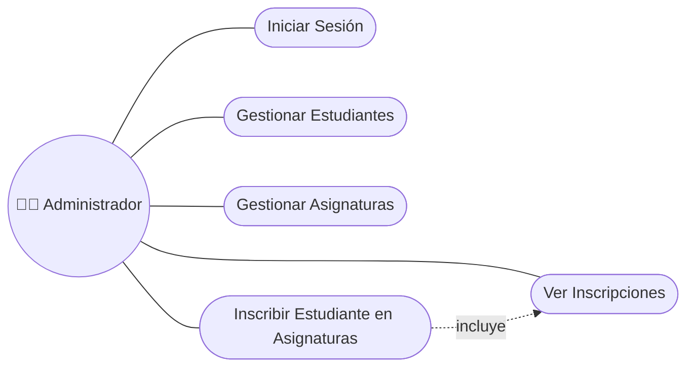

</details>

<details>
<summary><b>📝 Caso de Uso Detallado — UC04: Inscribir Estudiante en Asignaturas</b></summary>

| Campo | Descripción |
|:---|:---|
| **Actor** | Administrador |
| **Precondiciones** | El administrador ha iniciado sesión; el estudiante existe. |
| **Flujo Principal** | 1. Seleccionar un estudiante.<br>2. Se carga la lista "Asignaturas Disponibles".<br>3. Mover las asignaturas deseadas a la lista "Inscritas".<br>4. Hacer clic en "Confirmar".<br>5. El sistema valida las reglas de negocio (RN01, RN02).<br>6. La inscripción se persiste mediante Hibernate. |
| **Flujo Alternativo** | 5a. Si se supera el máximo de 6 asignaturas, mostrar un mensaje de validación. |
| **Postcondiciones** | Se guardan nuevos registros de `Inscripción` en la base de datos. |

</details>

---

## 🔗 3. Matriz de Trazabilidad de Requisitos

<details open>
<summary><b>📊 Tabla de Trazabilidad</b></summary>

| Requisito | Caso de Uso | Componente / Clase | Caso de Prueba |
|:---|:---|:---|:---|
| RF01 | UC01 | `LoginController`, `User` | TC01 |
| RF02 | UC02 | `StudentController`, `StudentDAO` | TC02 |
| RF03 | UC03 | `SubjectController`, `SubjectDAO` | TC03 |
| RF04 | UC04 | `DualListSelector`, `EnrollmentService` | TC04 |
| RF05 | UC02, UC03, UC04 | `HibernateUtil`, todos los DAO | TC05 |
| RF06 | UC05 | `EnrollmentDAO`, `EnrollmentReportView` | TC06 |
| RF07 | UC04 | `EnrollmentService.cancel()` | TC07 |
| RN01, RN02 | UC04 | `EnrollmentService.validate()` | TC08 |

</details>

---

## 📄 4. Especificación de Requisitos de Software (SRS)

<details open>
<summary><b>📃 Resumen del SRS (estructura IEEE 830)</b></summary>

| Sección | Contenido |
|:---|:---|
| **1. Introducción** | Propósito: definir un sistema de escritorio para inscripción académica. Alcance: gestión de estudiantes, asignaturas e inscripciones con un selector de lista doble reutilizable. |
| **2. Descripción General** | Aplicación de escritorio Java Swing independiente, arquitectura MVC, Hibernate ORM, base de datos H2 embebida. |
| **3. Requisitos Específicos** | Ver [Sección 1 — Requisitos](#-1-requisitos) (RF, RNF, RN, Dominio, Datos, Interfaz). |
| **4. Interfaces Externas** | Interfaz gráfica (Swing); interfaz de persistencia (Hibernate/JDBC con H2). |
| **5. Restricciones** | Java 23+, Maven 3.8+, uso de escritorio para un solo usuario. |
| **6. Criterios de Aceptación** | Todos los casos de uso (UC01–UC05) ejecutables sin errores; datos persistidos entre sesiones. |

</details>

---

## 🧬 5. Diagramas UML y Estructurales

<details>
<summary><b>1️⃣ Diagrama de Casos de Uso</b></summary>

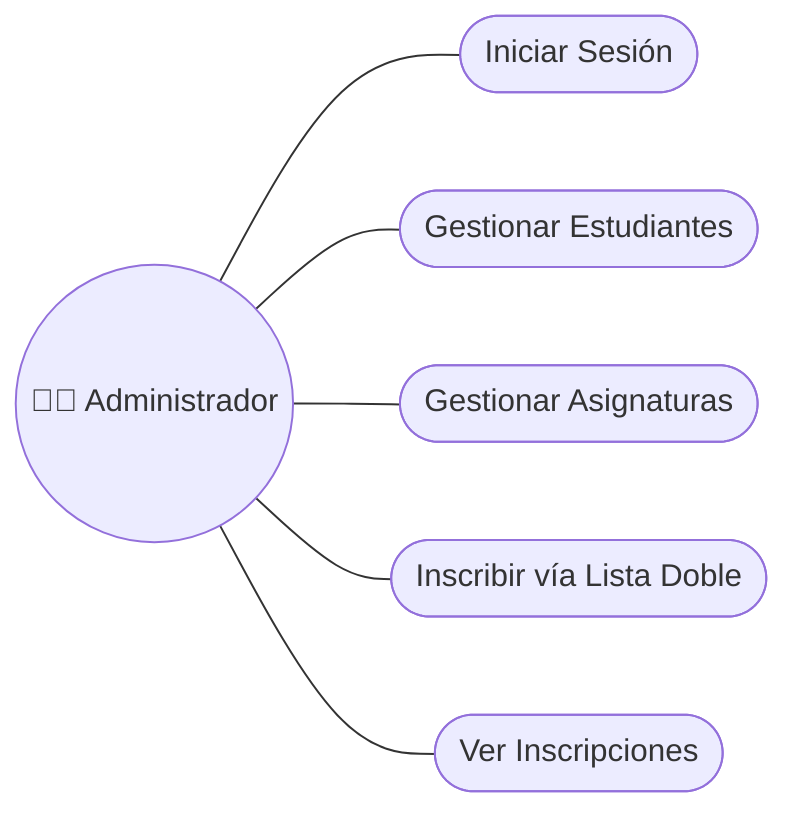

</details>

<details>
<summary><b>2️⃣ Diagrama de Clases</b></summary>

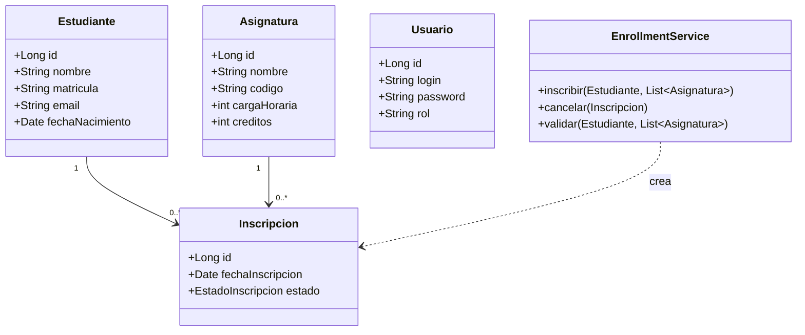

</details>

<details>
<summary><b>3️⃣ Diagrama de Objetos</b></summary>

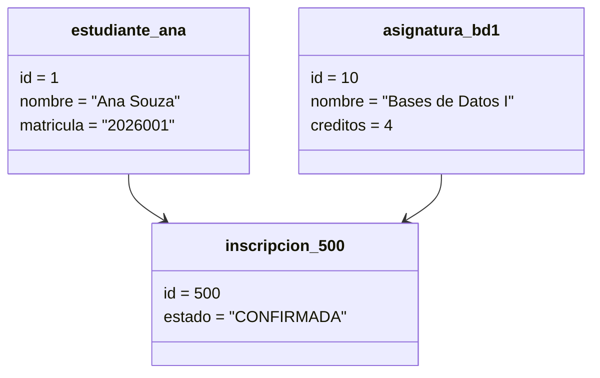

</details>

<details>
<summary><b>4️⃣ Diagrama de Secuencia — Inscribir Estudiante</b></summary>

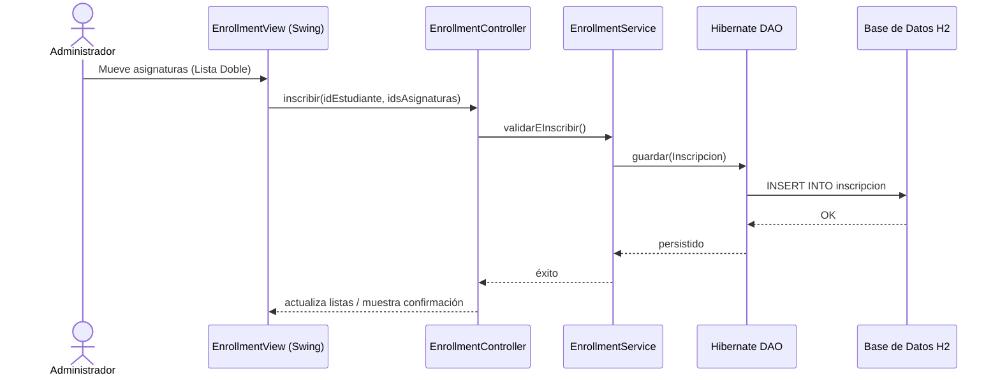

</details>

<details>
<summary><b>5️⃣ Diagrama de Comunicación (Colaboración)</b></summary>

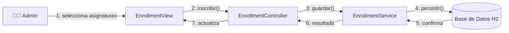

</details>

<details>
<summary><b>6️⃣ Diagrama de Actividades</b></summary>

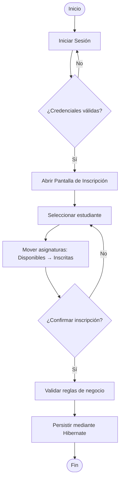

</details>

<details>
<summary><b>7️⃣ Diagrama de Máquina de Estados — Inscripción</b></summary>

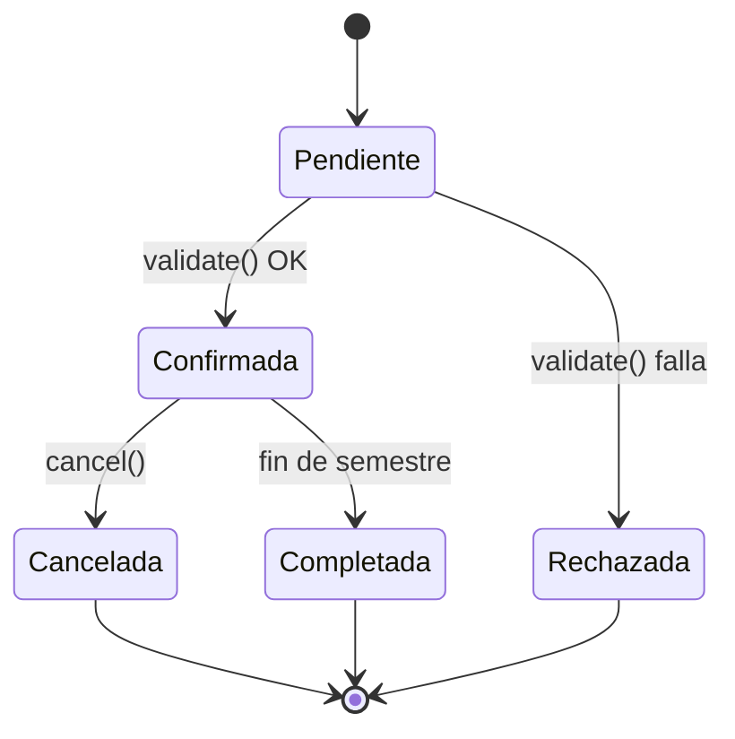

</details>

<details>
<summary><b>8️⃣ Diagrama de Componentes</b></summary>

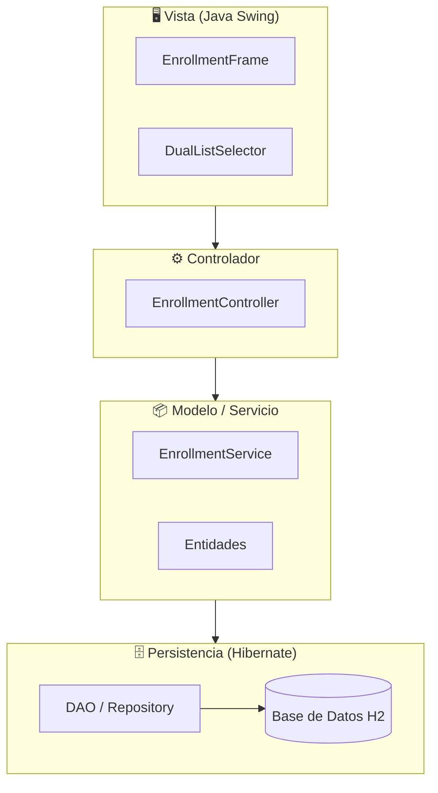

</details>

<details>
<summary><b>9️⃣ Diagrama de Despliegue</b></summary>

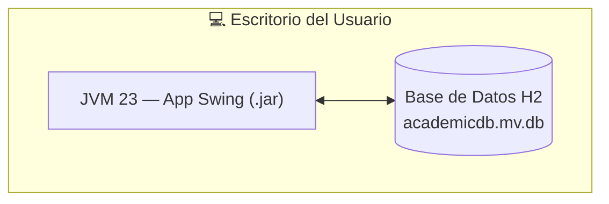

</details>

<details>
<summary><b>🔟 Diagrama de Paquetes</b></summary>

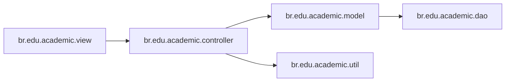

</details>

<details>
<summary><b>1️⃣1️⃣ Diagrama de Estructura Compuesta — DualListSelector</b></summary>

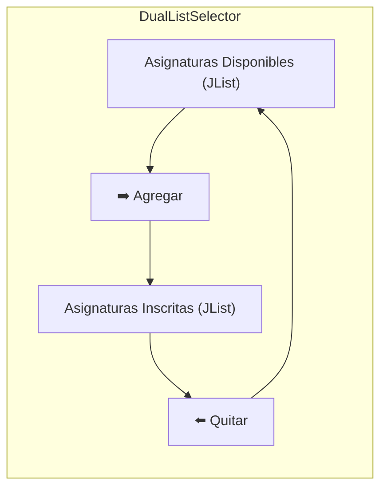

</details>

<details>
<summary><b>1️⃣2️⃣ Diagrama de Visión General de Interacción</b></summary>

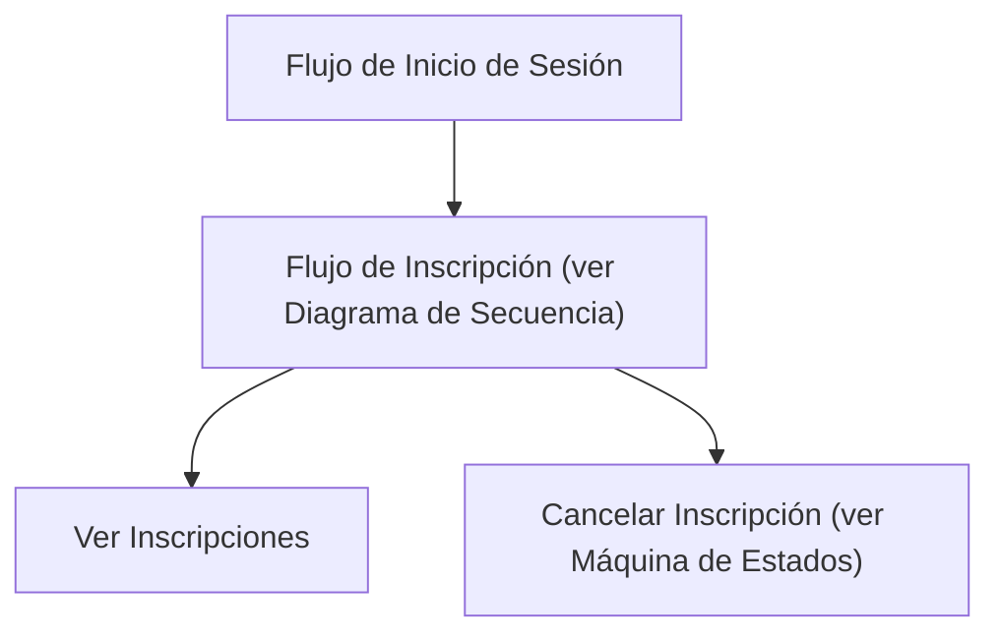

</details>

<details>
<summary><b>1️⃣3️⃣ Diagrama de Tiempo (Timing)</b></summary>

| Tiempo | Administrador | EnrollmentController | Base de Datos H2 |
|:---|:---|:---|:---|
| t0 | Inactivo | Inactivo | Inactivo |
| t1 | Seleccionando asignaturas | Inactivo | Inactivo |
| t2 | Hace clic en "Confirmar" | Procesando solicitud | Inactivo |
| t3 | Esperando | Llamando a `save()` | Escribiendo |
| t4 | Ve la confirmación | Inactivo | Confirmado (commit) |

</details>

---

## 🗄️ 6. Modelo de Datos y Diccionario de Datos

<details open>
<summary><b>🔗 Diagrama Entidad-Relación (DER)</b></summary>

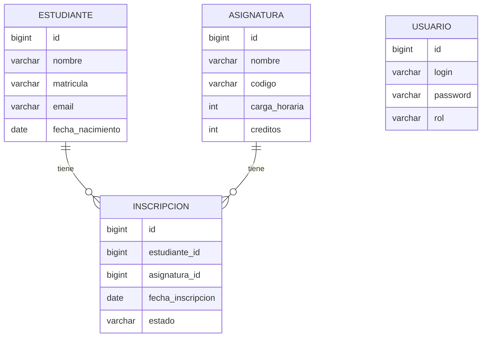

</details>

<details>
<summary><b>🧠 Modelo Conceptual de Datos</b></summary>

Un **Estudiante** puede tener muchas **Inscripciones**; una **Asignatura** puede tener muchas **Inscripciones**. Una **Inscripción** vincula exactamente a un Estudiante con una Asignatura (entidad asociativa). Un **Usuario** representa una cuenta de administrador, independiente de las entidades académicas.

</details>

<details>
<summary><b>🧩 Modelo Lógico de Datos</b></summary>

| Entidad | Atributo | Tipo | Clave |
|:---|:---|:---|:---|
| Estudiante | id, nombre, matricula, email, fechaNacimiento | Long, String, String, String, Date | PK: id |
| Asignatura | id, nombre, codigo, cargaHoraria, creditos | Long, String, String, int, int | PK: id |
| Inscripcion | id, estudianteId, asignaturaId, fechaInscripcion, estado | Long, Long(FK), Long(FK), Date, Enum | PK: id |
| Usuario | id, login, password, rol | Long, String, String, String | PK: id |

</details>

<details>
<summary><b>⚙️ Modelo Físico de Datos (DDL H2)</b></summary>

```sql
CREATE TABLE estudiante (
    id BIGINT AUTO_INCREMENT PRIMARY KEY,
    nombre VARCHAR(120) NOT NULL,
    matricula VARCHAR(20) UNIQUE NOT NULL,
    email VARCHAR(120) NOT NULL,
    fecha_nacimiento DATE
);

CREATE TABLE asignatura (
    id BIGINT AUTO_INCREMENT PRIMARY KEY,
    nombre VARCHAR(120) NOT NULL,
    codigo VARCHAR(10) UNIQUE NOT NULL,
    carga_horaria INT NOT NULL,
    creditos INT NOT NULL
);

CREATE TABLE inscripcion (
    id BIGINT AUTO_INCREMENT PRIMARY KEY,
    estudiante_id BIGINT NOT NULL REFERENCES estudiante(id),
    asignatura_id BIGINT NOT NULL REFERENCES asignatura(id),
    fecha_inscripcion DATE NOT NULL,
    estado VARCHAR(15) NOT NULL,
    UNIQUE (estudiante_id, asignatura_id)
);
```

</details>

<details>
<summary><b>📖 Diccionario de Datos</b></summary>

| Entidad | Campo | Tipo | Restricciones | Descripción |
|:---|:---|:---|:---|:---|
| Estudiante | matricula | VARCHAR(20) | UNIQUE, NOT NULL | Número de matrícula institucional |
| Estudiante | email | VARCHAR(120) | NOT NULL, formato validado | Correo electrónico del estudiante |
| Asignatura | codigo | VARCHAR(10) | UNIQUE, NOT NULL | Código de la asignatura (ej.: BD101) |
| Asignatura | creditos | INT | NOT NULL | Número de créditos académicos |
| Inscripcion | estado | VARCHAR(15) | ENUM: PENDIENTE/CONFIRMADA/CANCELADA/COMPLETADA | Estado actual de la inscripción |
| Inscripcion | (estudiante_id, asignatura_id) | par FK | UNIQUE | Garantiza la regla de negocio RN01 |

</details>

---

## 🔄 7. Diagrama de Flujo de Datos (DFD) y Linaje de Datos

<details open>
<summary><b>🌐 DFD — Nivel 0 (Contexto)</b></summary>

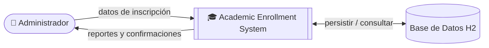

</details>

<details>
<summary><b>🔬 DFD — Nivel 1</b></summary>

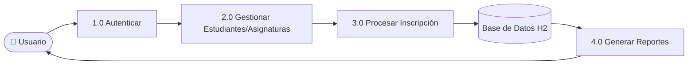

</details>

<details>
<summary><b>🧵 Diagrama de Linaje de Datos</b></summary>

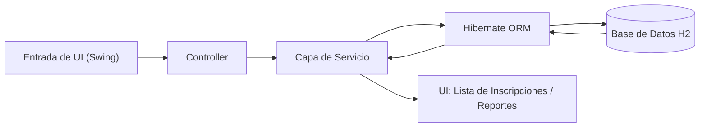

</details>

---

## 🏗️ 8. Diagrama de Arquitectura y Diagrama de Flujo

<details open>
<summary><b>🏛️ Visión General de la Arquitectura (Capas MVC)</b></summary>

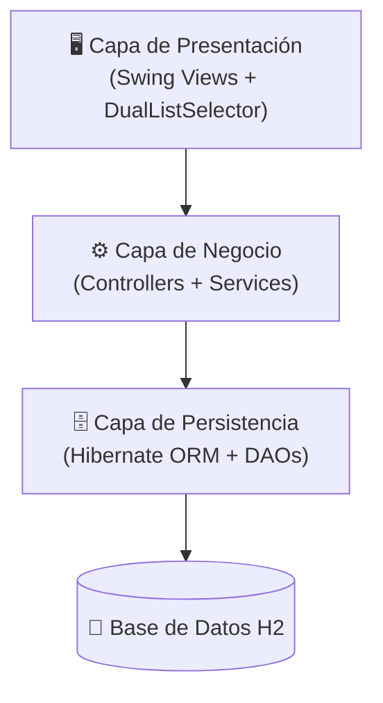

</details>

<details>
<summary><b>🔀 Diagrama de Flujo General de la Aplicación</b></summary>

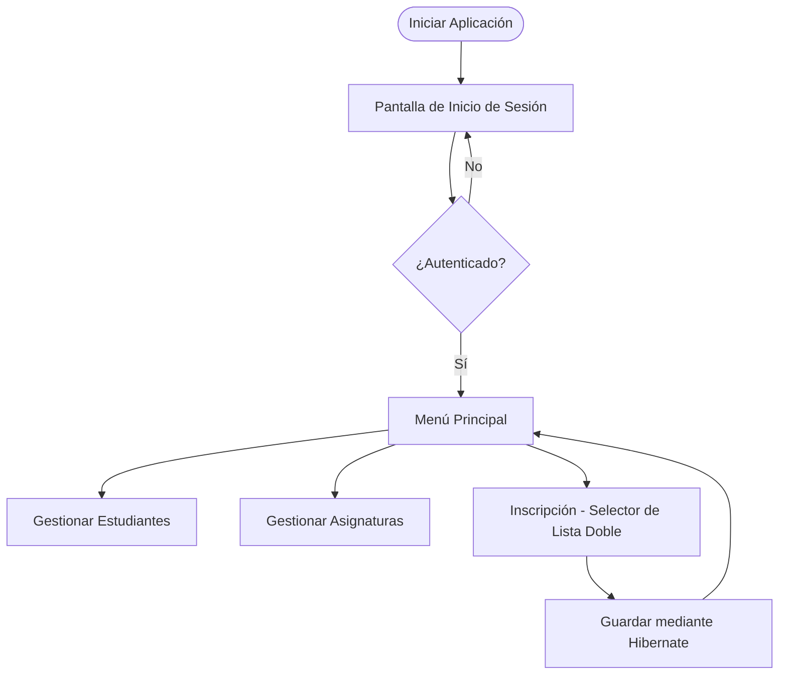

</details>

---

## 🧑 9. Persona y Mapa de Viaje del Usuario

<details open>
<summary><b>🙋 Persona — Coordinadora Académica</b></summary>

| Campo | Descripción |
|:---|:---|
| **Nombre** | Ana Souza |
| **Cargo** | Coordinadora Académica |
| **Edad** | 38 |
| **Objetivos** | Inscribir estudiantes en asignaturas rápidamente cada semestre, sin errores. |
| **Frustraciones** | Hojas de cálculo manuales que permiten inscripciones duplicadas. |
| **Habilidad Técnica** | Intermedia — cómoda con software de escritorio. |

</details>

<details>
<summary><b>🗺️ Mapa de Viaje del Usuario</b></summary>

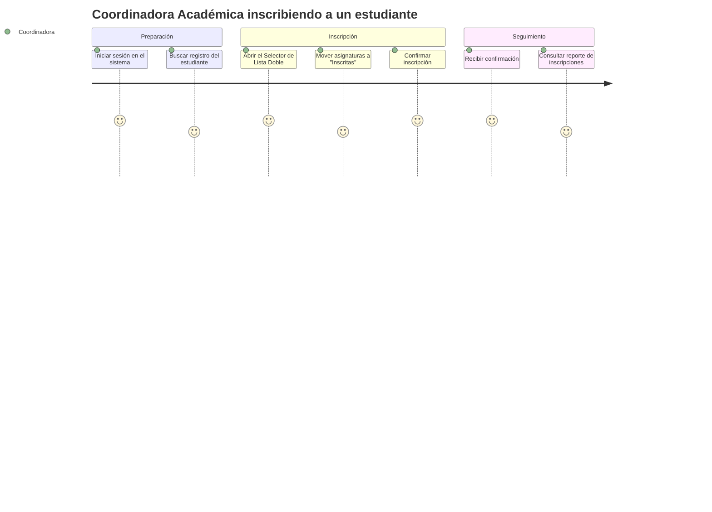

</details>

---

## 🖼️ 10. Wireframes y Mockups

<details open>
<summary><b>📐 Wireframe — Pantalla de Inscripción</b></summary>

```
┌──────────────────────────────────────────────────────────┐
│  🎓 Academic Enrollment System                     [_][X] │
├──────────────────────────────────────────────────────────┤
│ Estudiante: [ Ana Souza (2026001)         ▼ ]             │
├────────────────────────────┬───────────┬─────────────────┤
│  Asignaturas Disponibles     │           │  Inscritas      │
│ ┌──────────────────────────┐│   [ ➡️ ]  │┌───────────────┐│
│ │ Algoritmos I                ││   [ ⬅️ ]  ││ Bases de Datos││
│ │ Sistemas Operativos          ││           ││ Cálculo II    ││
│ │ Redes                        ││           ││               ││
│ └──────────────────────────┘│           │└───────────────┘│
├────────────────────────────┴───────────┴─────────────────┤
│                                  [ Cancelar ] [ Confirmar ✅ ]│
└──────────────────────────────────────────────────────────┘
```

</details>

<details>
<summary><b>🎨 Mockup — Concepto de Alta Fidelidad</b></summary>

```
╔════════════════════════════════════════════════════════════╗
║ 🎓  ACADEMIC ENROLLMENT SYSTEM                 🟢 admin    ║
╠════════════════════════════════════════════════════════════╣
║  👤 Estudiante: Ana Souza — Matrícula 2026001               ║
║                                                              ║
║  📚 DISPONIBLES           📗 INSCRITAS                      ║
║  ┌────────────────┐       ┌────────────────┐               ║
║  │ Algoritmos I    │  ➡️  │ Bases de Datos I│               ║
║  │ Sist. Operativos│  ⬅️  │ Cálculo II      │               ║
║  │ Redes           │       │                 │               ║
║  └────────────────┘       └────────────────┘               ║
║                                                              ║
║              [ ❌ Cancelar ]   [ ✅ Confirmar Inscripción ] ║
╚════════════════════════════════════════════════════════════╝
```

</details>

---

## 🚀 11. Instalación y Ejecución

<details open>
<summary><b>📋 Requisitos Previos</b></summary>

- ☕ Java JDK 23
- 📦 Maven 3.8+
- 🔧 Git (opcional)
- 💻 IDE recomendado: IntelliJ IDEA

</details>

<details open>
<summary><b>🛠️ Pasos</b></summary>

1. **Clona el repositorio:**

```bash
git clone https://github.com/VictorHJesusSantiago/buslist4hibernate.git
```

2. Abre el proyecto en tu IDE y deja que Maven descargue las dependencias desde `pom.xml`.
3. Configura el Project SDK en Java 23.
4. Ejecuta `src/main/java/br/edu/academic/MainApp.java`.

</details>

<details>
<summary><b>🔑 Acceso Predeterminado</b></summary>

En la primera ejecución, el sistema crea automáticamente:

| Campo | Valor |
|:---|:---|
| **Usuario** | `admin` |
| **Contraseña** | `1234` |

</details>

---

## 👤 12. Autor

<div align="center">

| | |
|:---:|:---|
| 🧑‍💻 | **Victor Henrique de Jesus Santiago** — Full Stack Developer |
| 📧 | victorhenriquedejesussantiago@gmail.com |
| 💼 | [LinkedIn](https://www.linkedin.com/in/victor-henrique-de-jesus-santiago/) |
| 🐙 | [GitHub/VictorHJesusSantiago](https://github.com/VictorHJesusSantiago) |

</div>
