<div align="center">


# 🎓 Academic Enrollment System

**Componente de Seleção de Lista Dupla com Persistência via Hibernate**

Uma solução desktop robusta construída em **Java Swing** sob a **arquitetura MVC**. O projeto foca em um componente visual reutilizável para seleção de itens e persistência de dados usando **Hibernate ORM**.


### 🌐 Choose Language / Selecione o idioma / Elija su idioma

[](./README.md)
[](./README_PT.md)
[](./README_ES.md)

</div>

---

## 📘 Sobre o Projeto

> O **Academic Enrollment System** é uma aplicação desktop construída para demonstrar habilidades avançadas em **Programação Orientada a Objetos** e na **arquitetura MVC**. Sua principal funcionalidade é um componente reutilizável de **"Seleção de Lista Dupla"** usado para matricular alunos em disciplinas, com **persistência via Hibernate** e um banco de dados embarcado **H2**.

---

## 📑 Sumário

| # | Seção |
|:-:|:---|
| 1 | [📋 Requisitos](#-1-requisitos) |
| 2 | [🧩 Casos de Uso](#-2-casos-de-uso) |
| 3 | [🔗 Matriz de Rastreabilidade de Requisitos](#-3-matriz-de-rastreabilidade-de-requisitos) |
| 4 | [📄 Documento de Especificação de Requisitos de Software (SRS)](#-4-documento-de-especificação-de-requisitos-de-software-srs) |
| 5 | [🧬 Diagramas UML & Estruturais](#-5-diagramas-uml--estruturais) |
| 6 | [🗄️ Modelo de Dados & Dicionário de Dados](#️-6-modelo-de-dados--dicionário-de-dados) |
| 7 | [🔄 Diagrama de Fluxo de Dados (DFD) & Linhagem de Dados](#-7-diagrama-de-fluxo-de-dados-dfd--linhagem-de-dados) |
| 8 | [🏗️ Diagrama de Arquitetura & Fluxograma](#️-8-diagrama-de-arquitetura--fluxograma) |
| 9 | [🧑 Persona & Mapa de Jornada do Usuário](#-9-persona--mapa-de-jornada-do-usuário) |
| 10 | [🖼️ Wireframes & Mockups](#️-10-wireframes--mockups) |
| 11 | [🚀 Instalação & Execução](#-11-instalação--execução) |
| 12 | [👤 Autor](#-12-autor) |

---

## 📋 1. Requisitos

<details>
<summary><b>✅ Requisitos Funcionais (RF)</b></summary>

| ID | Descrição |
|:---|:---|
| **RF01** | O sistema deve permitir que um administrador faça login com usuário e senha. |
| **RF02** | O sistema deve permitir operações de CRUD para **Alunos**. |
| **RF03** | O sistema deve permitir operações de CRUD para **Disciplinas**. |
| **RF04** | O sistema deve fornecer um **Seletor de Lista Dupla** para mover disciplinas entre as listas "Disponíveis" e "Matriculadas". |
| **RF05** | O sistema deve persistir Alunos, Disciplinas e Matrículas via **Hibernate ORM**. |
| **RF06** | O sistema deve listar e filtrar as matrículas atuais de um aluno. |
| **RF07** | O sistema deve permitir o cancelamento de uma matrícula existente. |

</details>

<details>
<summary><b>⚙️ Requisitos Não Funcionais (RNF)</b></summary>

| ID | Descrição |
|:---|:---|
| **RNF01** | A interface gráfica deve ser construída com **Java Swing**, com layout que se adapta ao redimensionamento da janela. |
| **RNF02** | O sistema deve ser executado em **Java 23** ou superior. |
| **RNF03** | As operações de CRUD devem responder em menos de **1 segundo** para até 10.000 registros. |
| **RNF04** | O sistema deve ser portátil: um único JAR executável com banco de dados **H2** embarcado. |
| **RNF05** | O código-fonte deve seguir o padrão **MVC** para garantir a manutenibilidade. |

</details>

<details>
<summary><b>📐 Regras de Negócio (RN)</b></summary>

| ID | Descrição |
|:---|:---|
| **RN01** | Um aluno **não pode** ser matriculado duas vezes na mesma disciplina. |
| **RN02** | Um aluno pode ser matriculado em **no máximo 6 disciplinas** por semestre. |
| **RN03** | Uma disciplina só pode ser excluída se **não houver matrículas ativas**. |
| **RN04** | Somente administradores autenticados podem acessar as telas de gerenciamento. |

</details>

<details>
<summary><b>🌍 Requisitos de Domínio</b></summary>

- O sistema deve usar terminologia acadêmica consistente com o currículo da instituição (disciplinas, carga horária, créditos).
- Cada disciplina possui um número fixo de **créditos** e **carga horária (em horas)**, definidos pelo currículo.
- Os períodos de matrícula seguem o calendário acadêmico da instituição (por semestre).

</details>

<details>
<summary><b>💾 Requisitos de Dados</b></summary>

- Cada aluno deve ter um **número de matrícula único**.
- Os endereços de e-mail devem ser validados quanto ao formato correto.
- A integridade referencial deve ser garantida entre `Matrícula`, `Aluno` e `Disciplina`.
- Todas as entidades persistidas devem ter uma chave primária autogerada (`id`).

</details>

<details>
<summary><b>🖱️ Requisitos de Interface</b></summary>

- A tela de matrícula deve implementar o padrão **Seletor de Lista Dupla** (Disponíveis ⇄ Matriculadas).
- Acesso padrão na primeira execução: **usuário:** `admin` / **senha:** `1234`.
- Os itens podem ser movidos entre as listas por botões (`➡️`/`⬅️`) ou duplo clique.
- Os formulários devem exibir erros de validação em linha, próximos ao campo relacionado.

</details>

---

## 🧩 2. Casos de Uso

<details open>
<summary><b>📜 Tabela Resumo de Casos de Uso</b></summary>

| ID UC | Nome | Ator | Descrição |
|:---|:---|:---|:---|
| **UC01** | Login | Administrador | Autenticar-se no sistema. |
| **UC02** | Gerenciar Alunos | Administrador | Criar, ler, atualizar e excluir alunos. |
| **UC03** | Gerenciar Disciplinas | Administrador | Criar, ler, atualizar e excluir disciplinas. |
| **UC04** | Matricular Aluno em Disciplinas | Administrador | Usar o Seletor de Lista Dupla para matricular/desmatricular. |
| **UC05** | Visualizar Matrículas | Administrador | Listar e filtrar as matrículas de um aluno. |

</details>

<details>
<summary><b>🗺️ Diagrama de Casos de Uso</b></summary>

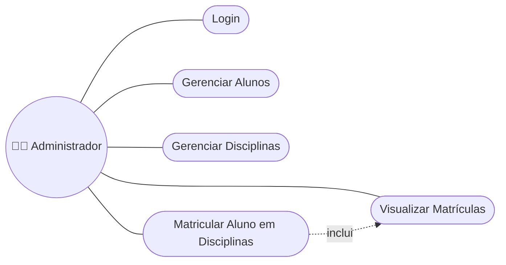

</details>

<details>
<summary><b>📝 Caso de Uso Detalhado — UC04: Matricular Aluno em Disciplinas</b></summary>

| Campo | Descrição |
|:---|:---|
| **Ator** | Administrador |
| **Pré-condições** | Administrador está autenticado; o aluno existe. |
| **Fluxo Principal** | 1. Selecionar um aluno.<br>2. A lista "Disciplinas Disponíveis" é carregada.<br>3. Mover as disciplinas desejadas para a lista "Matriculadas".<br>4. Clicar em "Confirmar".<br>5. O sistema valida as regras de negócio (RN01, RN02).<br>6. A matrícula é persistida via Hibernate. |
| **Fluxo Alternativo** | 5a. Se o limite de 6 disciplinas for excedido, exibir mensagem de validação. |
| **Pós-condições** | Novos registros de `Matrícula` são salvos no banco de dados. |

</details>

---

## 🔗 3. Matriz de Rastreabilidade de Requisitos

<details open>
<summary><b>📊 Tabela de Rastreabilidade</b></summary>

| Requisito | Caso de Uso | Componente / Classe | Caso de Teste |
|:---|:---|:---|:---|
| RF01 | UC01 | `LoginController`, `User` | TC01 |
| RF02 | UC02 | `StudentController`, `StudentDAO` | TC02 |
| RF03 | UC03 | `SubjectController`, `SubjectDAO` | TC03 |
| RF04 | UC04 | `DualListSelector`, `EnrollmentService` | TC04 |
| RF05 | UC02, UC03, UC04 | `HibernateUtil`, todos os DAOs | TC05 |
| RF06 | UC05 | `EnrollmentDAO`, `EnrollmentReportView` | TC06 |
| RF07 | UC04 | `EnrollmentService.cancel()` | TC07 |
| RN01, RN02 | UC04 | `EnrollmentService.validate()` | TC08 |

</details>

---

## 📄 4. Documento de Especificação de Requisitos de Software (SRS)

<details open>
<summary><b>📃 Resumo do SRS (estrutura IEEE 830)</b></summary>

| Seção | Conteúdo |
|:---|:---|
| **1. Introdução** | Propósito: definir um sistema desktop de matrícula acadêmica. Escopo: gerenciamento de alunos, disciplinas e matrículas com um seletor de lista dupla reutilizável. |
| **2. Descrição Geral** | Aplicação desktop Java Swing autônoma, arquitetura MVC, Hibernate ORM, banco de dados H2 embarcado. |
| **3. Requisitos Específicos** | Ver [Seção 1 — Requisitos](#-1-requisitos) (RF, RNF, RN, Domínio, Dados, Interface). |
| **4. Interfaces Externas** | Interface gráfica (Swing); interface de persistência (Hibernate/JDBC com H2). |
| **5. Restrições** | Java 23+, Maven 3.8+, uso desktop single-user. |
| **6. Critérios de Aceitação** | Todos os casos de uso (UC01–UC05) executáveis sem erros; dados persistidos entre sessões. |

</details>

---

## 🧬 5. Diagramas UML & Estruturais

<details>
<summary><b>1️⃣ Diagrama de Casos de Uso</b></summary>

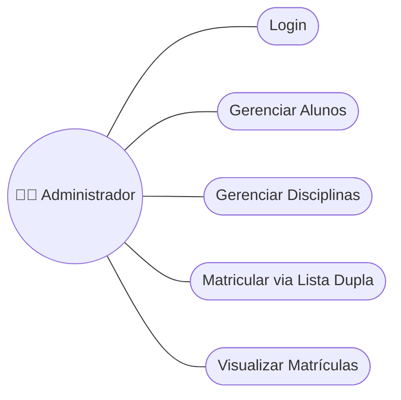

</details>

<details>
<summary><b>2️⃣ Diagrama de Classes</b></summary>

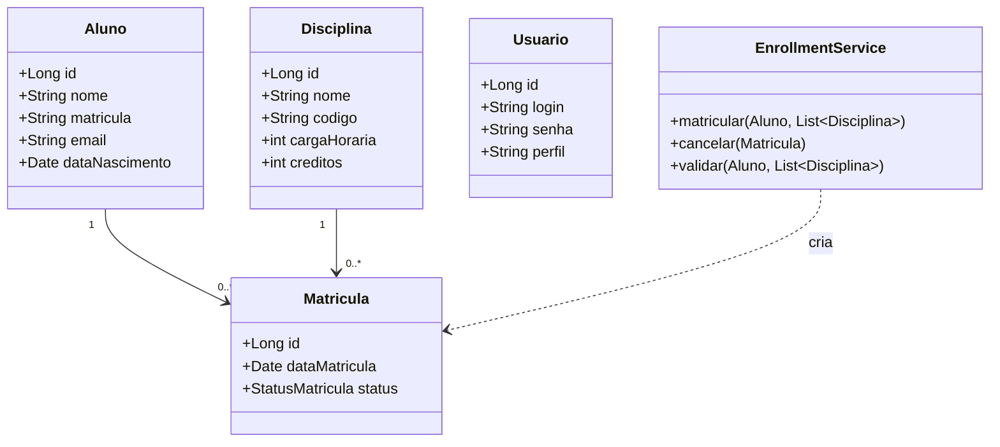

</details>

<details>
<summary><b>3️⃣ Diagrama de Objetos</b></summary>

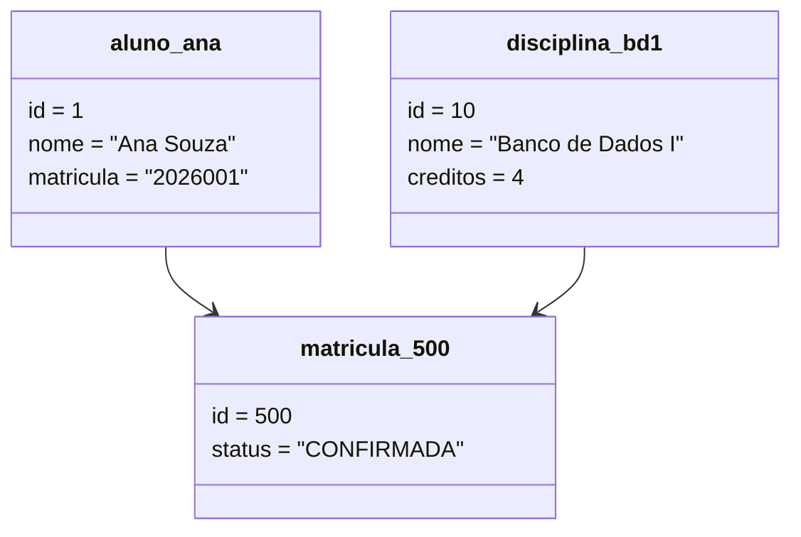

</details>

<details>
<summary><b>4️⃣ Diagrama de Sequência — Matricular Aluno</b></summary>

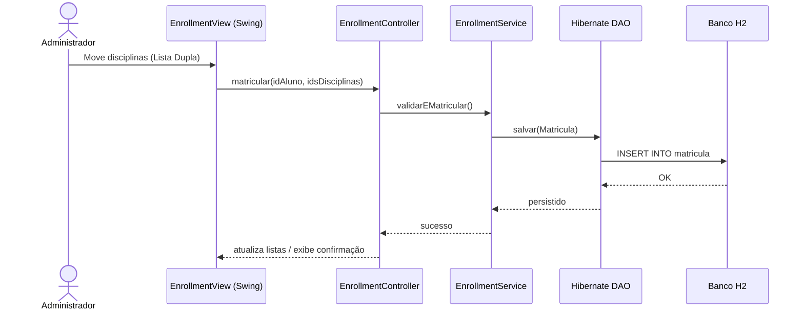

</details>

<details>
<summary><b>5️⃣ Diagrama de Comunicação (Colaboração)</b></summary>

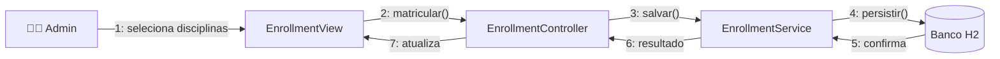

</details>

<details>
<summary><b>6️⃣ Diagrama de Atividades</b></summary>

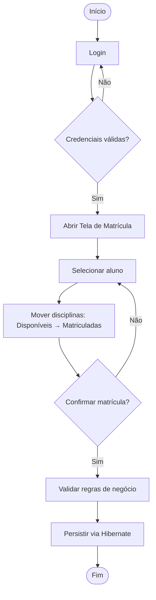

</details>

<details>
<summary><b>7️⃣ Diagrama de Máquina de Estados — Matrícula</b></summary>

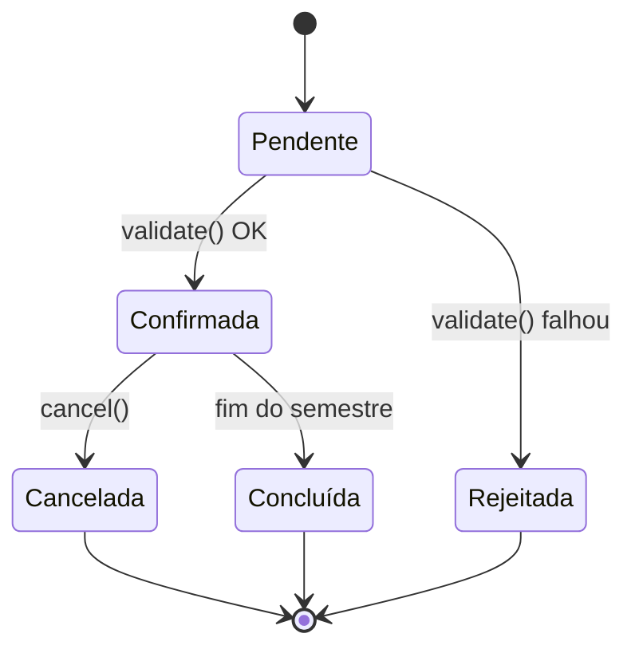

</details>

<details>
<summary><b>8️⃣ Diagrama de Componentes</b></summary>

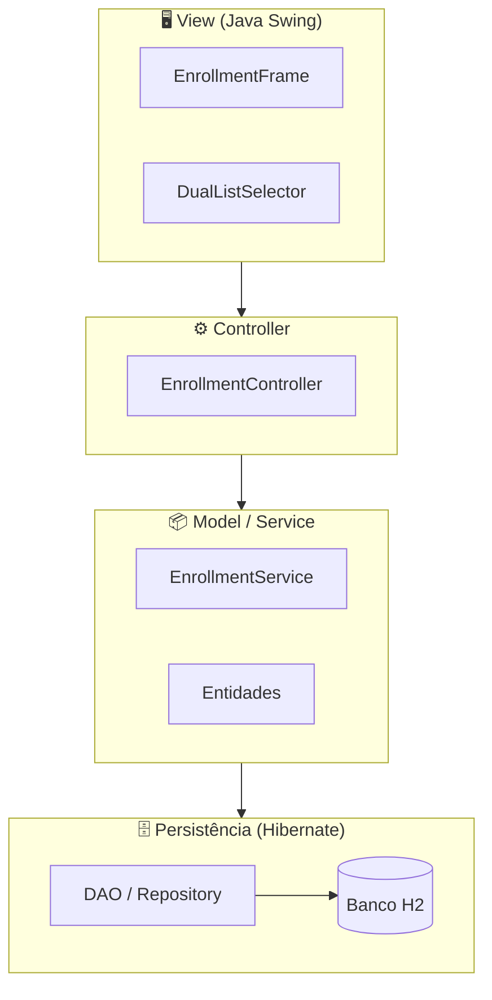

</details>

<details>
<summary><b>9️⃣ Diagrama de Implantação</b></summary>

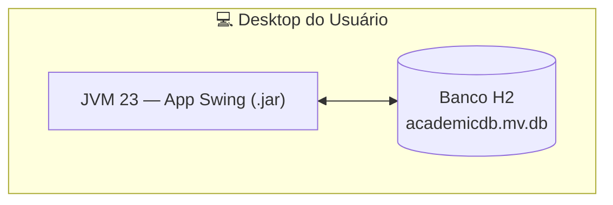

</details>

<details>
<summary><b>🔟 Diagrama de Pacotes</b></summary>

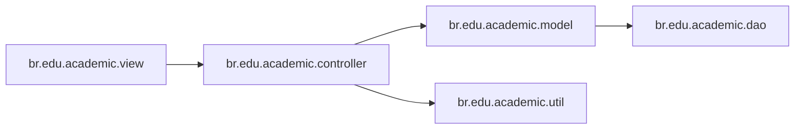

</details>

<details>
<summary><b>1️⃣1️⃣ Diagrama de Estrutura Composta — DualListSelector</b></summary>

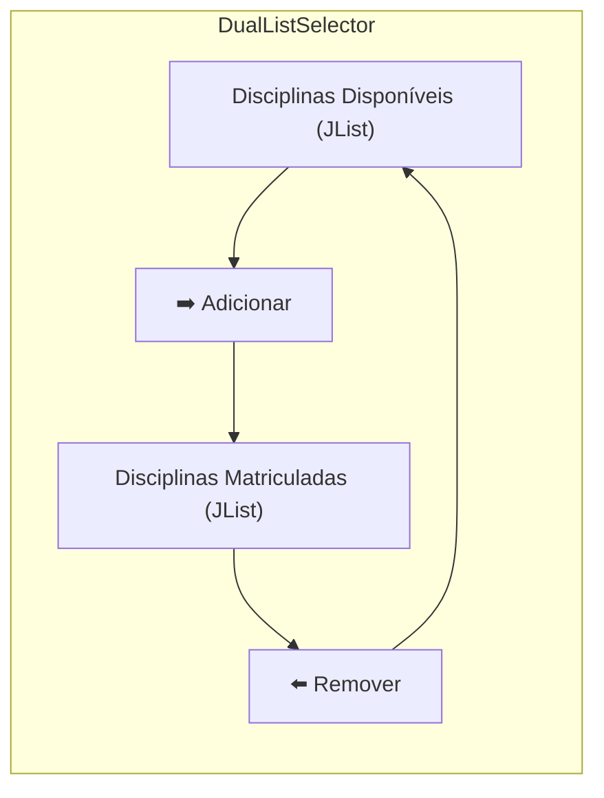

</details>

<details>
<summary><b>1️⃣2️⃣ Diagrama de Visão Geral de Interação</b></summary>

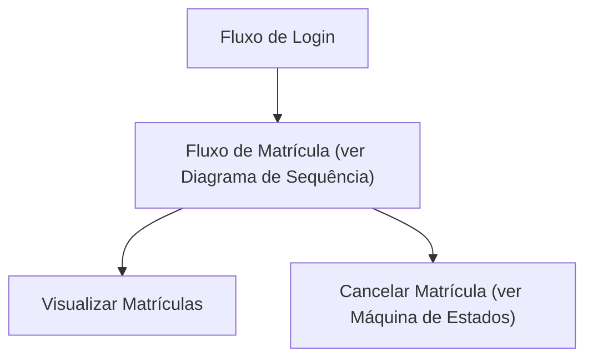

</details>

<details>
<summary><b>1️⃣3️⃣ Diagrama de Tempo (Timing)</b></summary>

| Tempo | Administrador | EnrollmentController | Banco H2 |
|:---|:---|:---|:---|
| t0 | Ocioso | Ocioso | Ocioso |
| t1 | Selecionando disciplinas | Ocioso | Ocioso |
| t2 | Clica em "Confirmar" | Processando requisição | Ocioso |
| t3 | Aguardando | Chamando `save()` | Escrevendo |
| t4 | Vê confirmação | Ocioso | Commit realizado |

</details>

---

## 🗄️ 6. Modelo de Dados & Dicionário de Dados

<details open>
<summary><b>🔗 Diagrama Entidade-Relacionamento (DER)</b></summary>

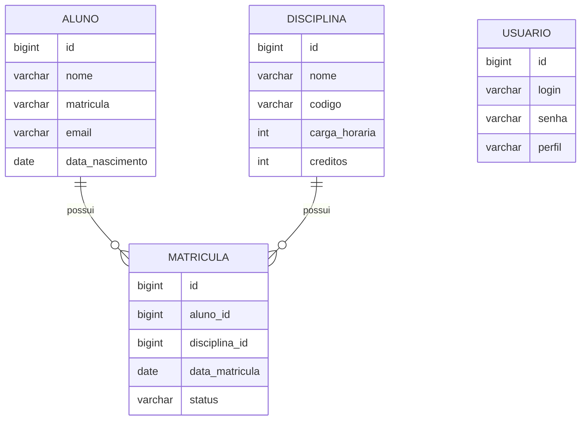

</details>

<details>
<summary><b>🧠 Modelo Conceitual de Dados</b></summary>

Um **Aluno** pode ter várias **Matrículas**; uma **Disciplina** pode ter várias **Matrículas**. Uma **Matrícula** vincula exatamente um Aluno a uma Disciplina (entidade associativa). Um **Usuário** representa uma conta de administrador, independente das entidades acadêmicas.

</details>

<details>
<summary><b>🧩 Modelo Lógico de Dados</b></summary>

| Entidade | Atributo | Tipo | Chave |
|:---|:---|:---|:---|
| Aluno | id, nome, matricula, email, dataNascimento | Long, String, String, String, Date | PK: id |
| Disciplina | id, nome, codigo, cargaHoraria, creditos | Long, String, String, int, int | PK: id |
| Matricula | id, alunoId, disciplinaId, dataMatricula, status | Long, Long(FK), Long(FK), Date, Enum | PK: id |
| Usuario | id, login, senha, perfil | Long, String, String, String | PK: id |

</details>

<details>
<summary><b>⚙️ Modelo Físico de Dados (DDL H2)</b></summary>

```sql
CREATE TABLE aluno (
    id BIGINT AUTO_INCREMENT PRIMARY KEY,
    nome VARCHAR(120) NOT NULL,
    matricula VARCHAR(20) UNIQUE NOT NULL,
    email VARCHAR(120) NOT NULL,
    data_nascimento DATE
);

CREATE TABLE disciplina (
    id BIGINT AUTO_INCREMENT PRIMARY KEY,
    nome VARCHAR(120) NOT NULL,
    codigo VARCHAR(10) UNIQUE NOT NULL,
    carga_horaria INT NOT NULL,
    creditos INT NOT NULL
);

CREATE TABLE matricula (
    id BIGINT AUTO_INCREMENT PRIMARY KEY,
    aluno_id BIGINT NOT NULL REFERENCES aluno(id),
    disciplina_id BIGINT NOT NULL REFERENCES disciplina(id),
    data_matricula DATE NOT NULL,
    status VARCHAR(15) NOT NULL,
    UNIQUE (aluno_id, disciplina_id)
);
```

</details>

<details>
<summary><b>📖 Dicionário de Dados</b></summary>

| Entidade | Campo | Tipo | Restrições | Descrição |
|:---|:---|:---|:---|:---|
| Aluno | matricula | VARCHAR(20) | UNIQUE, NOT NULL | Número de matrícula institucional |
| Aluno | email | VARCHAR(120) | NOT NULL, formato validado | E-mail do aluno |
| Disciplina | codigo | VARCHAR(10) | UNIQUE, NOT NULL | Código da disciplina (ex: BD101) |
| Disciplina | creditos | INT | NOT NULL | Número de créditos acadêmicos |
| Matricula | status | VARCHAR(15) | ENUM: PENDENTE/CONFIRMADA/CANCELADA/CONCLUÍDA | Estado atual da matrícula |
| Matricula | (aluno_id, disciplina_id) | par FK | UNIQUE | Garante a regra de negócio RN01 |

</details>

---

## 🔄 7. Diagrama de Fluxo de Dados (DFD) & Linhagem de Dados

<details open>
<summary><b>🌐 DFD — Nível 0 (Contexto)</b></summary>

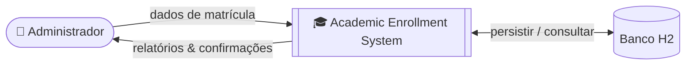

</details>

<details>
<summary><b>🔬 DFD — Nível 1</b></summary>

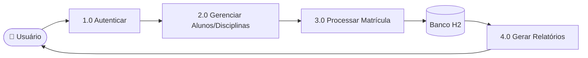

</details>

<details>
<summary><b>🧵 Diagrama de Linhagem de Dados</b></summary>

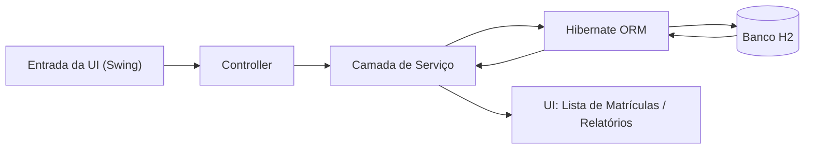

</details>

---

## 🏗️ 8. Diagrama de Arquitetura & Fluxograma

<details open>
<summary><b>🏛️ Visão Geral da Arquitetura (Camadas MVC)</b></summary>

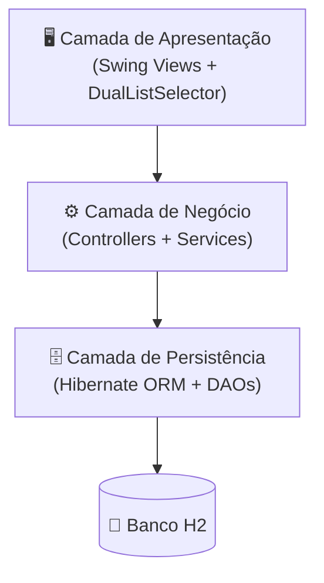

</details>

<details>
<summary><b>🔀 Fluxograma Geral da Aplicação</b></summary>

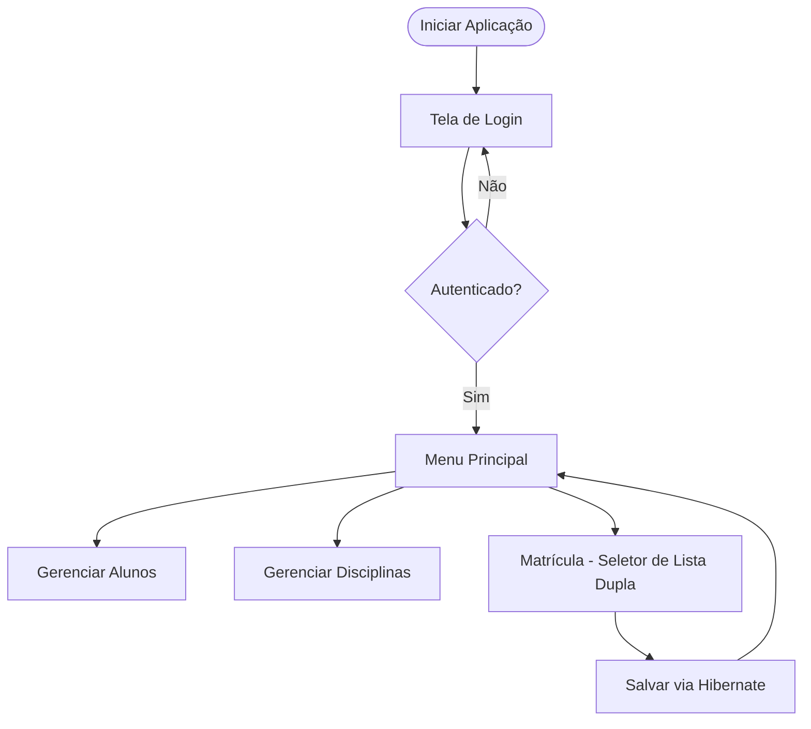

</details>

---

## 🧑 9. Persona & Mapa de Jornada do Usuário

<details open>
<summary><b>🙋 Persona — Coordenadora Acadêmica</b></summary>

| Campo | Descrição |
|:---|:---|
| **Nome** | Ana Souza |
| **Cargo** | Coordenadora Acadêmica |
| **Idade** | 38 |
| **Objetivos** | Matricular alunos em disciplinas rapidamente a cada semestre, sem erros. |
| **Frustrações** | Planilhas manuais que permitem matrículas duplicadas. |
| **Habilidade Técnica** | Intermediária — confortável com softwares desktop. |

</details>

<details>
<summary><b>🗺️ Mapa de Jornada do Usuário</b></summary>

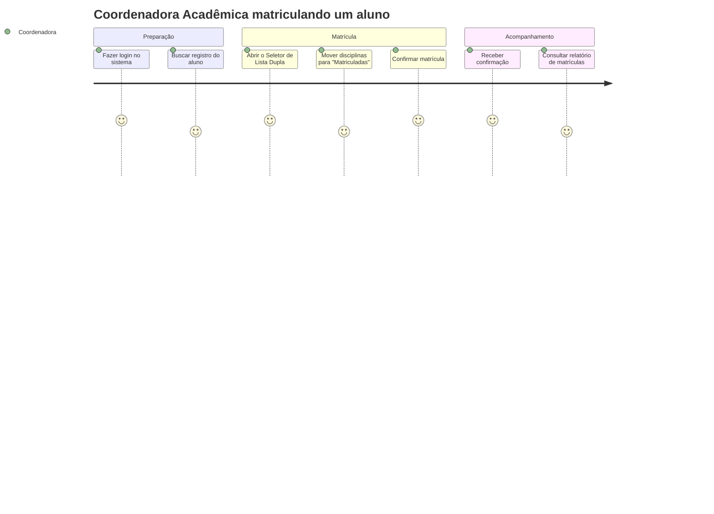

</details>

---

## 🖼️ 10. Wireframes & Mockups

<details open>
<summary><b>📐 Wireframe — Tela de Matrícula</b></summary>

```
┌──────────────────────────────────────────────────────────┐
│  🎓 Academic Enrollment System                     [_][X] │
├──────────────────────────────────────────────────────────┤
│ Aluno: [ Ana Souza (2026001)              ▼ ]             │
├────────────────────────────┬───────────┬─────────────────┤
│  Disciplinas Disponíveis     │           │  Matriculadas   │
│ ┌──────────────────────────┐│   [ ➡️ ]  │┌───────────────┐│
│ │ Algoritmos I                ││   [ ⬅️ ]  ││ Banco de Dados││
│ │ Sistemas Operacionais        ││           ││ Cálculo II    ││
│ │ Redes                        ││           ││               ││
│ └──────────────────────────┘│           │└───────────────┘│
├────────────────────────────┴───────────┴─────────────────┤
│                                  [ Cancelar ] [ Confirmar ✅ ]│
└──────────────────────────────────────────────────────────┘
```

</details>

<details>
<summary><b>🎨 Mockup — Conceito de Alta Fidelidade</b></summary>

```
╔════════════════════════════════════════════════════════════╗
║ 🎓  ACADEMIC ENROLLMENT SYSTEM                 🟢 admin    ║
╠════════════════════════════════════════════════════════════╣
║  👤 Aluno: Ana Souza — Matrícula 2026001                    ║
║                                                              ║
║  📚 DISPONÍVEIS           📗 MATRICULADAS                   ║
║  ┌────────────────┐       ┌────────────────┐               ║
║  │ Algoritmos I    │  ➡️  │ Banco de Dados I│               ║
║  │ Sist. Operac.   │  ⬅️  │ Cálculo II      │               ║
║  │ Redes           │       │                 │               ║
║  └────────────────┘       └────────────────┘               ║
║                                                              ║
║              [ ❌ Cancelar ]   [ ✅ Confirmar Matrícula ]   ║
╚════════════════════════════════════════════════════════════╝
```

</details>

---

## 🚀 11. Instalação & Execução

<details open>
<summary><b>📋 Pré-requisitos</b></summary>

- ☕ Java JDK 23
- 📦 Maven 3.8+
- 🔧 Git (opcional)
- 💻 IDE recomendada: IntelliJ IDEA

</details>

<details open>
<summary><b>🛠️ Passos</b></summary>

1. **Clone o repositório:**

```bash
git clone https://github.com/VictorHJesusSantiago/buslist4hibernate.git
```

2. Abra o projeto na sua IDE e deixe o Maven baixar as dependências do `pom.xml`.
3. Defina o Project SDK para Java 23.
4. Execute `src/main/java/br/edu/academic/MainApp.java`.

</details>

<details>
<summary><b>🔑 Acesso Padrão</b></summary>

Na primeira execução, o sistema cria automaticamente:

| Campo | Valor |
|:---|:---|
| **Usuário** | `admin` |
| **Senha** | `1234` |

</details>

---

## 👤 12. Autor

<div align="center">

| | |
|:---:|:---|
| 🧑‍💻 | **Victor Henrique de Jesus Santiago** — Full Stack Developer |
| 📧 | victorhenriquedejesussantiago@gmail.com |
| 💼 | [LinkedIn](https://www.linkedin.com/in/victor-henrique-de-jesus-santiago/) |
| 🐙 | [GitHub/VictorHJesusSantiago](https://github.com/VictorHJesusSantiago) |

</div>
